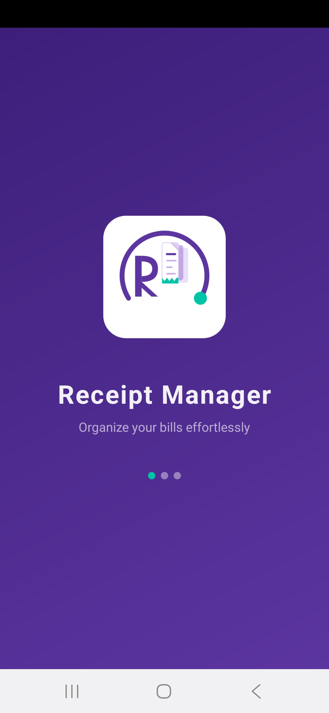
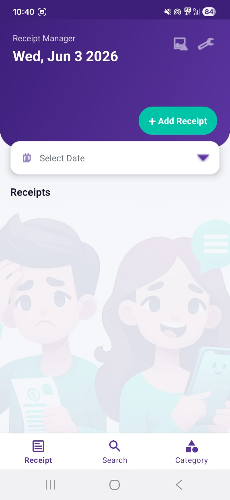
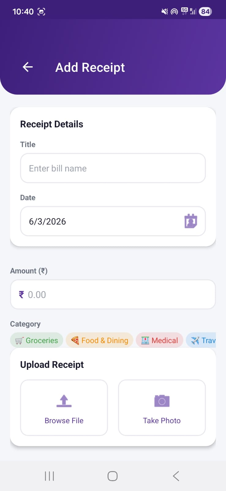
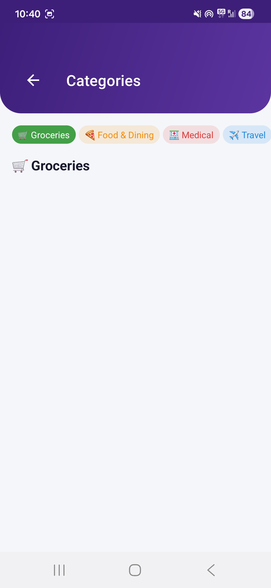
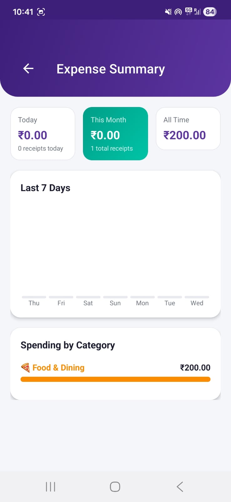
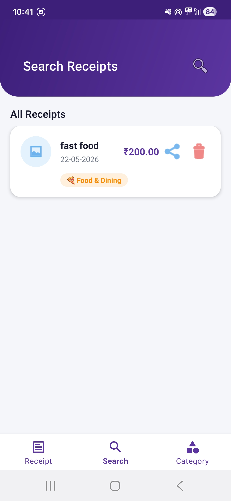
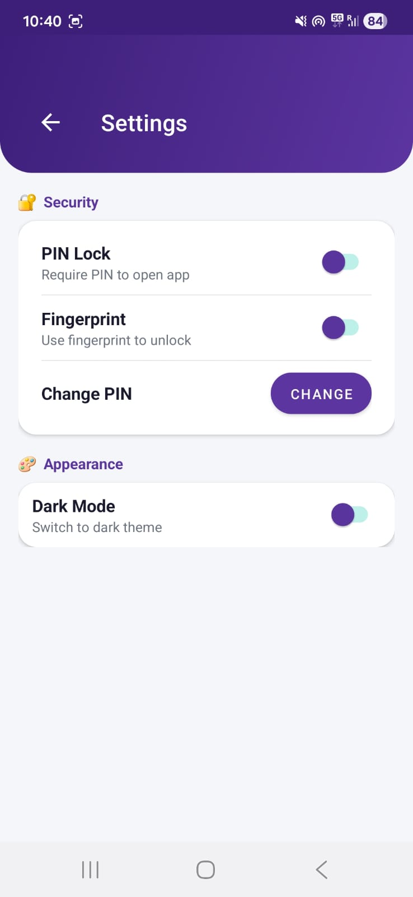
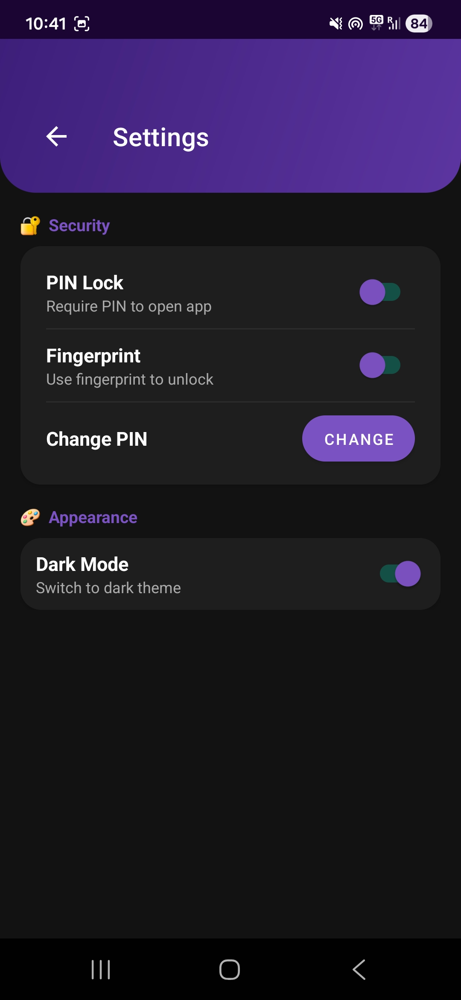

# Receipt Manager

Ever lost a receipt when you needed it most? Struggled to remember how much you spent last month? Missed a bill in your budget because you couldn't find the paper?
I've been there too. That's exactly why I built this app.
Receipt Manager is a native Android app that keeps all your bills and receipts in one place — organized, searchable, and always with you on your phone. No more lost receipts. No more guessing your expenses. No more broken budgets.

## The Problem

Managing receipts manually is frustrating:

- 🧾 Paper receipts get lost, damaged or faded
- 🔍 Finding a specific old bill takes forever
- 💸 No easy way to track how much you actually spent
- 📂 No structure — just a pile of papers in a drawer

Receipt Manager solves all of this from your phone.

## What It Does

**📥 Save Receipts**  
Take a photo directly from the app or upload an existing file — JPG, PNG, PDF, even Word documents. Give it a name, pick a date, choose a category and you're done.

**📅 Browse by Date**  
Tap the date bar on the home screen to pick any date and instantly see all receipts from that day. Great for end of month tracking.

**🔎 Search Instantly**  
Switch to the Search tab and start typing — receipts filter in real time as you type. No waiting, no loading.

**🏷️ Categories**  
Tag each receipt as Groceries, Medical, Food & Dining, Travel, Utilities, Entertainment and more. The Categories tab shows everything grouped and filtered beautifully.

**💰 Expense Tracker**  
See how much you spent today, this month and overall. A weekly bar chart breaks it down day by day. A category breakdown shows exactly where your money is going.

**📤 Share Anywhere**  
Tap the share button on any receipt and send it instantly via WhatsApp, Email, Google Drive — wherever you need it.

**🔐 PIN & Fingerprint Lock**  
Enable a 4-digit PIN or use your fingerprint to lock the app. Every time you open it authentication is required. Your receipts stay private.

**🌙 Dark Mode**  
A full dark theme that's easy on the eyes. Toggle it from Settings and the whole app switches instantly.

---

## Screenshots

| Landing Page | Home Screen | Add Receipt |
|-------------|-------------|------------|
|  |  |  |

| Categories | Expense Tracker | Search |
|------------|----------------|--------|
|  |  |  |

| Settings | Dark Mode |
|----------|-----------|
|  |  |

---

## Tech Stack

Built entirely with native Android — no cross-platform frameworks.

| What | Why |
|------|-----|
| **Kotlin** | Primary language — clean, concise, modern |
| **SQLite** | Local database — stores all receipt data offline |
| **Material Design 3** | Google's design system for a polished UI |
| **BiometricPrompt API** | Handles fingerprint and PIN authentication |
| **FileProvider** | Secure file sharing between apps |
| **RecyclerView + CardView** | Smooth scrollable receipt list with card UI |
| **SharedPreferences** | Saves theme and security settings |
| **Background Threading** | Database queries run in background — UI never freezes |

## Project Structure

```
app/src/main/java/com/receiptmanager/
│
├── ui/
│   ├── SplashActivity.kt        # Launch screen with logo animation
│   ├── MainActivity.kt          # Home — receipt list + date filter
│   ├── AddReceiptActivity.kt    # Add new receipt form
│   ├── CategoryActivity.kt      # Browse by category
│   ├── ExpenseActivity.kt       # Spending summary + charts
│   ├── LockScreen.kt            # PIN entry screen
│   ├── SetupPinActivity.kt      # PIN creation screen
│   ├── SettingsActivity.kt      # App settings
│   └── MyApp.kt                 # Application class
│
├── db/
│   └── DatabaseHelper.kt        # SQLite — all queries in one place
│
├── model/
│   └── Receipt.kt               # Data — id, title, date, path, category, amount
│
├── adapter/
│   └── ReceiptAdapter.kt        # Binds receipts to RecyclerView cards
│
└── util/
    ├── FileManager.kt           # Save, delete, share files
    ├── CategoryHelper.kt        # Category names, colors, emojis
    ├── PinManager.kt            # PIN storage and verification
    └── ThemeManager.kt          # Dark/light mode toggle
```


## How to Run

```bash
git clone https://github.com/Shreya-coder-star/ReceiptManager.git
```

1. Open in **Android Studio**
2. Let Gradle sync finish
3. Connect a device or start an emulator
4. Hit **Run** ▶️

**Minimum Android:** 5.0 Lollipop (API 21)  
**Target SDK:** Android 14 (API 34)


## What I Learned Building This

- Designing a complete Android app architecture from scratch — database layer, UI layer, utility layer all working together cleanly
- Working with SQLite directly — writing raw queries, handling schema upgrades and version management
- Android file system — securely storing, accessing and sharing files using FileProvider
- Biometric authentication using AndroidX BiometricPrompt API
- Building a UI that feels professional and polished — not just functional
- Background threading so the app never freezes even on slower devices
- Thinking through real user problems and turning them into features that actually help

## 📲 Try It Yourself

Want to try Receipt Manager on your Android phone?

[⬇️ Download APK](https://github.com/Shreya-coder-star/ReceiptManager/raw/main/app-debug.apk)

> Just download, install and try it out. Works on Android 5.0 and above.


